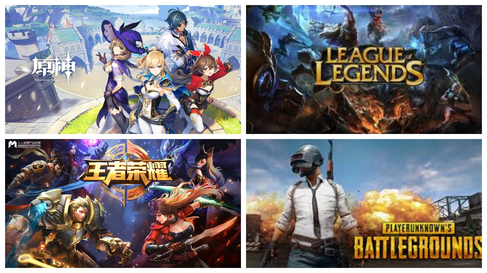
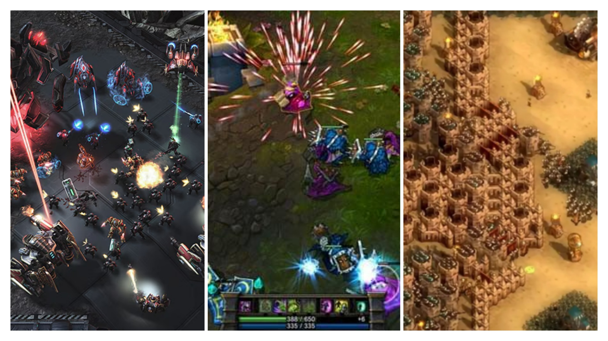
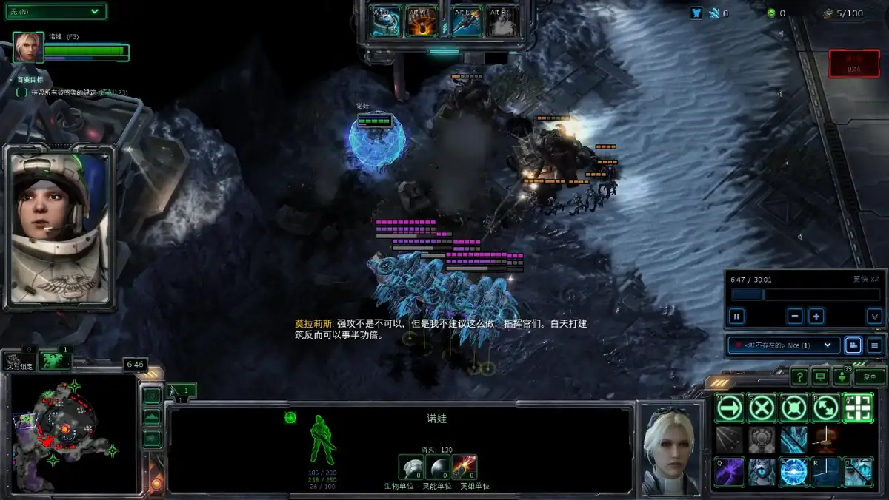
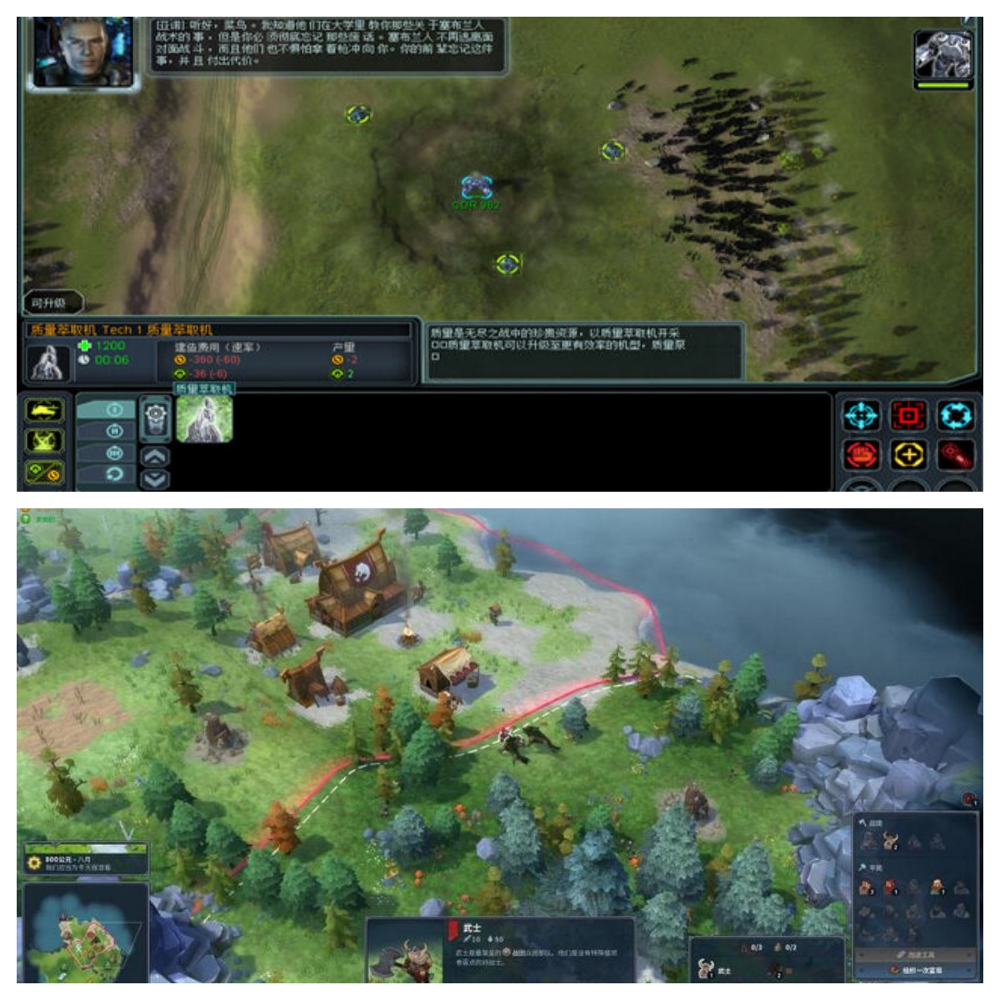

# 即时战略游戏的前世今生：一个独立开发者的游戏设计观察与思考

大家好，我是老李。

许多朋友知道我是个独立游戏开发者，但在敲下这些代码之前，我首先是个玩家，一个看着RTS游戏成长起来的铁杆粉丝。

我至今还记得第一次在电脑房玩到《命令与征服：红色警戒2》的那个下午，当基地车展开，电厂、兵营拔地而起，当第一个光棱坦克从重工厂里缓缓驶出时，那种融合了创造、经营与征服的快感，瞬间击中了我。从那以后，《星际争霸》的虫海战术、《帝国时代》的时代演进、《魔兽争霸3》的英雄史诗……RTS陪我度过了无数个不眠之夜，也最终将我引上了游戏设计的道路。

但近年来，每当和朋友、同行聊起RTS，我们的话题总是围绕着“没落”、“硬核”、“劝退”这些词汇，语气里满是惋惜。作为从业者，我知道这里有市场的变迁；但作为玩家，我总觉得故事不该是这样。

于是，我决定写下这篇文章，试图从一个游戏设计者的角度，重新梳理RTS这个伟大类型的生命轨迹。我想探讨的，不是它如何“衰亡”，而是它如何**“演变”**。

这篇文章，我想从：

* 昨天：黄金帝国的盛世与其光芒下的阴影
* 今天：旧帝国的窘境与新大陆的发现
* 明天：希望的航路和设计的新大陆

等三方面一起聊聊这个让玩家和设计师又爱又恨的游戏品类。

---

## 昨天：黄金帝国的盛世与其光芒下的阴影

### **黄金时代的范式**

RTS游戏，即“即时战略游戏”。 它的“昨天”，是一部波澜壮阔的史诗。它的开国元勋是《沙丘II》，它确立了那个我们无比熟悉的、优雅的“4E”核心循环：

* **探索与扩张 (Explore & Expand)**
* **资源开发 (Exploit)**
* **科技攀升 (Escalate)** 
* **武力征服 (Exterminate)**

这个范式是如此成功，以至于它成为了一个帝国强盛的基石。

随后的《命令与征服》、《帝国时代》都是在这个基石上建造起了宏伟的殿堂。
直到1998年，暴雪用《星际争霸》为这个帝国戴上了最璀璨的王冠。
三个设计迥异却奇迹般平衡的种族，将“即时博弈”这个基因的潜力挖掘到了极致，并与“电子竞技”这一新生事物完美融合，缔造了一个真正的黄金时代。

### 盛世之下埋下的“祸根”

然而，作为设计师，我们在回味这段辉煌时，必须敏锐地察觉到那些在当时看似荣耀，却为“今天”的窘境埋下伏笔的设计倾向。

**第一个祸根，是竞技对大众的“驱逐”**。

当《星际争霸》成为韩国的“国技”，当WCG的冠军成为无数人的偶像时，游戏的设计重心不可避免地向着“绝对公平”和“极限操作”倾斜。这直接导致了“技能壁垒”的不断升高。普通玩家的战术多样性，开始让位于职业选手的“最优解”。游戏变得越来越像一门需要“背板”和“练习”的体育运动，而逐渐失去了作为“游戏”的包容性。

**第二个祸根，是对PVE体验的“功利化”**。

我们都热爱《魔兽争霸3》的史诗战役，但纵观整个品类，战役模式越来越多地承担起“PVP教程”的职能。它的目标是让你熟悉单位、学会操作，好让你能尽快投身到“真正”的多人对战中去。那种纯粹为了体验一个好故事、打一场代入感十足的防守战的PVE乐趣，被逐渐边缘化了。

帝国的荣耀，建立在了对“普通公民”和“剧情爱好者”的忽视之上。当城墙高到普通人无法进入，当城内只有角斗场而没有歌剧院时，它的衰落便成了必然。

---

## 今天：旧帝国的窘境与新大陆的发现

### 传统RTS的“中年危机”

RTS的“今天”，面临着一场深刻的“中年危机”。

* **客观上**，市场环境变了。快节奏、碎片化的手游，体验更直接、更社交的MOBA和战术竞技游戏，都在争夺着玩家本就有限的时间。RTS这种需要高度专注、长时间投入的类型，显得有些“不合时宜”。
* **主观上**，“昨天”埋下的祸根全面爆发。高耸的技能壁垒吓跑了所有新人；僵化的核心玩法循环难以带来突破性的体验；漫长的开发周期和高昂的成本，也让商业公司望而却步。

于是，我们看到，那个曾经统一的、宏伟的“RTS帝国”，在今天的版图上，似乎只剩下几座孤零零的城邦。

### 新大陆的发现：帝国基因的‘意外’远征

但是，如果我们换一个视角，就会看到一幅截然不同的景象。帝国的子民并没有消失，他们只是带着帝国的“基因”，去寻找更适合自己生存的新大陆。

**这，就是RTS的“生态位细分”**。

* 那些痴迷于**英雄单位精妙微操**的玩家和设计师，创造了MOBA。它剔除了运营和建设的重担，将战斗的爽快感和团队协作放大到了极致。
* 那些沉醉于**排兵布阵、规划防御**的玩家和设计师，创造了塔防。它剥离了单位的移动控制，让策略的乐趣回归到最纯粹的空间管理和资源分配上。
* 那些享受**基地建设和对抗压力**的玩家和设计师，创造了生存建造游戏。它们将敌人从另一个玩家换成了海啸般的僵尸（《亿万僵尸》）或吞噬一切的严寒（《冰汽时代》），将PVP的竞技压力，转化为了PVE的生存史诗。

---

## 明天：希望的航路与设计的新大陆

### 细分领域的星辰大海

对于我们游戏设计者来说，“明天”的机会，首先就在于那些已被验证成功的细分领域。不要再想着“如何做出下一个《星际争霸》”，而要去思考：

* **我能否将RTS的基因与另一个类型“杂交”？** 比如《Northgard》成功融合了RTS与4X，《Dune: Spice Wars》融合了RTS与大战略。下一个成功的融合会是什么？RTS + Roguelike？RTS + RPG？这里有无尽的可能性。
* **我能否在PVE体验上做到极致？** 市场对高质量的PVE策略内容极度渴望。一个拥有电影级叙事、多样化关卡、充满力量幻想的RTS战役或合作模式，也许有能力成为一部爆款作品。

> 事实上，理论说起来容易，做起来还是有不少坑的。老李最近就在自己的知识星球“老李游戏学院”中，分享我用godot引擎制作融合机制游戏过程中的一些思考和踩坑经验。感兴趣的同行可以进来一起“监工”和讨论！

### **传统RTS的“重生企划”**

那么，那个我们最初爱上的、最“传统”的RTS，就真的没有未来了吗？我不这么认为。但它的重生，必须建立在对“今天”的深刻反思之上，进行彻底的设计思路调整。

* **设计思路一：PVE优先，体验至上。** 未来的传统RTS，应该将PVE内容视为产品的核心，而非PVP的附属品。用80%的精力去打磨一个让普通玩家能沉浸其中、获得乐趣和成就感的单人/合作体验。PVP可以作为服务核心粉丝的“添头”，但绝不能再绑架整个游戏的设计。
* **设计思路二：拥抱“不平衡”的乐趣。** 绝对的竞技平衡是PVP的追求，但对于PVE和合作模式来说，“不平衡”才是有趣的源泉。设计那些OP的、机制独特的、能让玩家“为所欲为”的单位和技能，让玩家体验到碾压AI的爽快感，这才是PVE的核心乐趣。
* **设计思路三：为“大脑”减负，而非为“手指”。** 真正的策略源于思考。我们应该用更现代的设计，去降低玩家不必要的“认知负荷”。比如更智能的单位AI（自动寻找掩体、自动释放简单技能）、更简洁的UI、更自动化的宏观运营选项等。把玩家的精力，从重复的机械操作中解放出来，让他们专注于真正的战略决策。

> 关于如何设计出“有乐趣”而非“愚蠢”的AI，以及如何在PVE关卡中控制玩家的情绪节奏，这些话题展开又是一篇万字长文。后续我计划在老李的知识星球——“老李游戏学院”中专门拆解《亿万僵尸》和《冰汽时代》等游戏的PVE设计精髓，并整理详细的设计文档，敬请期待！如果你对PVE设计有更深的兴趣，欢迎来我的知识星球做客。

---

## 最后的总结：我们不是守墓人，是播种者

以上便是我对于RTS这一游戏品类的回顾、理解和展望。
那么，在你看来，RTS的哪一段‘基因’最让你着迷？你期待的下一个‘即时策略’游戏，又该是什么模样？

其实写到这里，我的心情是释然甚至兴奋的。因为我意识到RTS没有死。它只是完成了自己作为“奠基者”的历史使命，然后将自己的血脉融入了游戏世界的汪洋大海。它就像一棵参天大树，如今主干不再疯狂生长，但它的种子，却已随风飘向四方，长成了形态各异的茂密森林。

对于仍然热爱着它的我们，无论是开发者还是玩家，或许都应该换一种心态。我们不是一个没落王朝的“守墓人”，而是一个伟大基因的“播种者”。

我们的使命，不再是去复刻那座早已成为纪念碑的旧帝国，而是去探索和开垦那些因RTS基因而变得无比肥沃的新大陆。

**那个属于RTS的黄金时代或许不会再来，但一个属于“即时策略”的、更广阔、更多元的“大航海时代”，才刚刚开始。**

谨以此文，与所有RTS游戏爱好者共勉。
——老李

---

## 关于我与“老李游戏学院”

大家好，我是老李。

如果你和我一样，不仅热爱探讨游戏设计的理论，更渴望在实践中创造属于自己的游戏，那么我诚挚地邀请你加入我的知识星球——「老李的游戏学院」。

这篇文章，只是我思考的冰山一角。在星球里，我们正在做更深入、更酷的事情：

* 【开发直播】：全程记录我用Godot引擎，将各种游戏设计思考制作成真正游戏Demo的全过程。
* 【深度拆解】：不定期发布一篇不对外的、更“硬核”的游戏设计案例拆解。
* 【精英社群】：这里聚集了数百位像你一样热爱游戏开发的独立开发者与爱好者，交流氛围极佳。
* 【向我提问】：所有关于Godot引擎、游戏设计、独立开发的问题，我都会一对一解答。

这不仅是一个知识付费社群，更是一个属于我们独立游戏人的“线上公会”。

扫描下方二维码，或在知识星球App搜索“老李的游戏学院”，期待与你同行。

